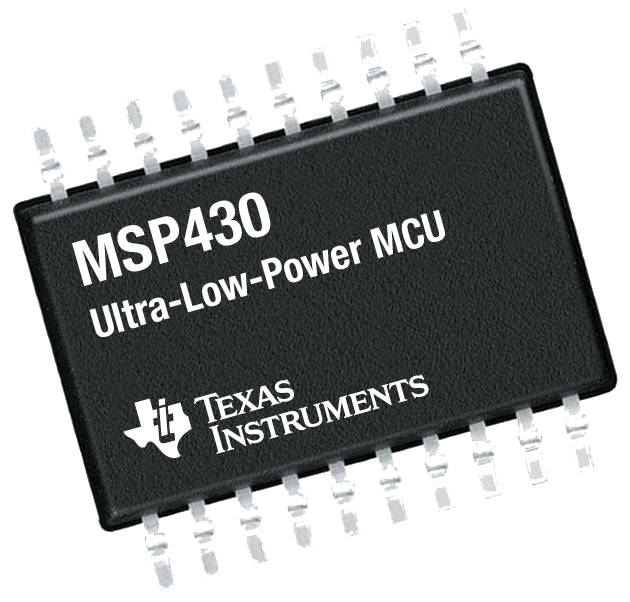

# Programando microcontroladores MSP430 no Raspberry Pi

Este tutorial tem como objetivo apresentar uma metodologia para programar microcontroladores MSP430 através do Raspberry Pi. Os procedimentos apresentados aqui são baseados em outro [tutorial](https://sergioprado.org/trabalhando-com-o-msp430-no-linux/) desenvolvido por Sergio Prado em sua página eletrônica [sergioprado.org](sergioprado.org), onde o foco é a programação do MSP430 no sistema Linux.

## Sumário

## O microcontrolador MSP430

O termo MSP430 se refere a uma arquitetura de microcontroladores RISC (acrônimo de _Reduced Instruction Set Computer_; em português, "Computador com um conjunto reduzido de instruções") de 16 bits e arquitetura von-Neumann. É desenvolvido e comercializado pela [Texas Instruments](https://www.ti.com/microcontrollers/msp430-ultra-low-power-mcus/overview.html), com foco em baixo custo e baixo consumo de energia. Dependendo do modo de economia de energia da CPU, o chip pode chegar num consumo tão baixo quanto 100 nA.

{:height="36px" width="36px"}

Possui diversos modelos, com um conjunto de periféricos bastante diversificado. Além disso, o fabricante oferece exemplos de programação de todos os periféricos, o que facilita muito o desenvolvimento de aplicações. Esses exemplos podem ser encontrados [clicando aqui](https://dev.ti.com/) (pode ser necessário criar uma conta).

### Kits de desenvolvimento _LaunchPad_

_LaunchPads_ são um conjunto de kits de desenvolvimento de baixo custo da Texas Instruments. Para o microcontrolador MSP430 existe uma boa variedade de modelos de placas, sendo que a mais simples e barata é a [MSP-EXP430G2ET](https://www.ti.com/tool/MSP-EXP430G2ET), com um custo de U$ 9,99.

### O kit MSP-EXP430G2ET

## O Raspberry Pi

## Requerimentos

Para este tutorial serão necessários os seguinte materiais:

 - Um Raspberry Pi de qualquer tipo;
 - Catão microSD com o Raspberry Pi OS instalado;
 - Fonte de alimentação para o Raspberry Pi;
 - Cabo HDMI;
 - Monitor, teclado e mouse; e
 - Microcontrolador MSP430 com gravador ([MSP-FET](https://www.ti.com/tool/MSP-FET)) ou Kit de desenvolvimento _LaunchPad_.

 Além desses materiais o usuário deverá possuir algum conhecimento básico de:

 - Microcontroladores;
 - Linguagem de programação C/C++;
 - Sistema Operacional Linux.