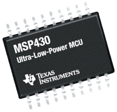
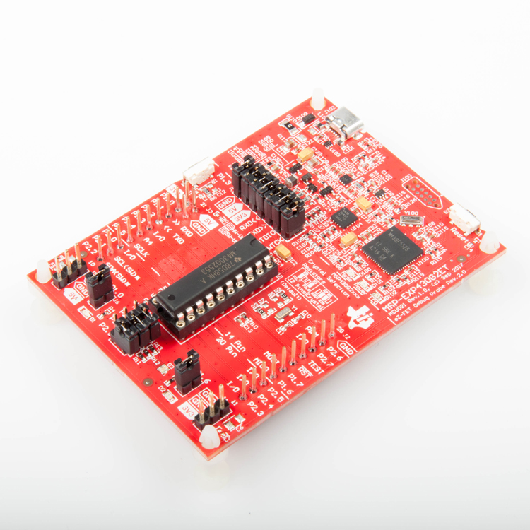
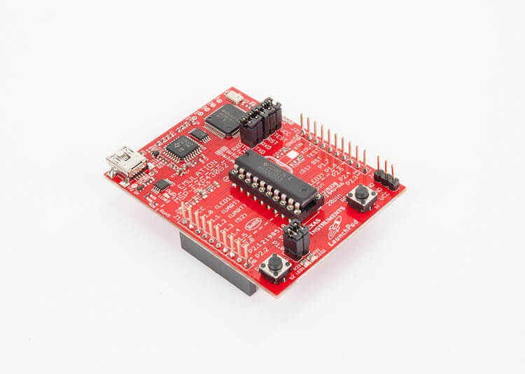

# Programando MSP430 no Raspberry Pi

Este tutorial tem como objetivo apresentar uma metodologia para programar microcontroladores MSP430 através do Raspberry Pi. Os procedimentos apresentados aqui são baseados em outro [tutorial](https://sergioprado.org/trabalhando-com-o-msp430-no-linux/) desenvolvido por Sergio Prado em sua página eletrônica [sergioprado.org](sergioprado.org), onde o foco é a programação do MSP430 no sistema Linux.

## Sumário

- [Programando MSP430 no Raspberry Pi](#programando-msp430-no-raspberry-pi)
  - [Sumário](#sumário)
  - [O microcontrolador MSP430](#o-microcontrolador-msp430)
  - [Kits de desenvolvimento _LaunchPad_](#kits-de-desenvolvimento-launchpad)
    - [O kit MSP-EXP430G2ET LaunchPad](#o-kit-msp-exp430g2et-launchpad)
    - [O kit MSP-EXP430G2](#o-kit-msp-exp430g2)
  - [O Raspberry Pi](#o-raspberry-pi)
  - [Requerimentos para a execução deste Tutorial](#requerimentos-para-a-execução-deste-tutorial)
  - [Instalando as ferramentas de desenvolvimento](#instalando-as-ferramentas-de-desenvolvimento)
  - [Criando códigos e Programando](#criando-códigos-e-programando)

## O microcontrolador MSP430

O termo MSP430 se refere a uma arquitetura de microcontroladores RISC (acrônimo de _Reduced Instruction Set Computer_; em português, "Computador com um conjunto reduzido de instruções") de 16 bits e arquitetura von-Neumann. É desenvolvido e comercializado pela [Texas Instruments](https://www.ti.com/microcontrollers/msp430-ultra-low-power-mcus/overview.html), com foco em baixo custo e baixo consumo de energia. Dependendo do modo de economia de energia da CPU, o chip pode chegar num consumo tão baixo quanto 100 nA. Uma imagem ilustrativa de um MSP430 pode ser vista na 
[Figura 1](#msp430).

||
|:---:|
|__Figura 1 - O microcontrolador MSP430__|

Possui diversos modelos, com um conjunto de periféricos bastante diversificado. Além disso, o fabricante oferece exemplos de programação de todos os periféricos, o que facilita muito o desenvolvimento de aplicações. Esses exemplos podem ser encontrados [clicando aqui](https://dev.ti.com/) (pode ser necessário criar uma conta).

## Kits de desenvolvimento _LaunchPad_

_LaunchPads_ são um conjunto de kits de desenvolvimento de baixo custo da Texas Instruments (TI). Para o microcontrolador MSP430 existe uma boa variedade de modelos de placas, sendo que a mais simples e barata é a [MSP-EXP430G2ET](https://www.ti.com/tool/MSP-EXP430G2ET), com um custo de U$ 9,99 (valaor verificado em 26/12/2020).

### O kit MSP-EXP430G2ET LaunchPad

O MSP-EXP430G2ET é o um do modelos mais simples e baratos que permite usar os microcontroladores MSP430 da série _Value Line_, sendo indicado para quem quer dar os passos iniciais nessa plataforma. Como pode ser visto na [Figura 2](#kit), o kit já vem de fábrica com o modelo MSP430G2553 instalado no soquete DIP (_Dual Inline Package_) de 20 pinos.

||
|:---:|
|__Figura 2 - MSP-EXP430G2ET LaunchPad: kit de desenvolvimento__|

Assim como o Arduino, o kit MSP-EXP430G2ET possui diversos pinos digitais de entrada e saída (GPIO), permitindo muita versatilidade aos projetos. Além disso, também possui dois LEDs e um botão. Como vantagem em relação à maioria dos modelos de Arduinos, essa placa possui embutida um gravador/depurador de código, permitindo a execução passo-a-passo das instruções.

### O kit MSP-EXP430G2

O MSP-EXP430G2, [Figura 3](#kit2), foi o kit utilizado para o desenvolvimento deste tutorial, devido a sua disponibilidade. É uma versão anterior e descontinuada do MSP-EXP430G2ET LaunchPad.

||
|:---:|
|__Figura 3 - MSP-EXP430G2 LaunchPad: kit de desenvolvimento utilizado neste tutorial__|

Apesar de ser mais antigo, o MSP-EXP430G2 possui praticamente as mesmas características que o MSP-EXP430G2ET.

## O Raspberry Pi

O Raspberry Pi é uma série computadores de tamanho reduzido feitos em uma única placa de circuito (_Single Board Computer_ ou SBC). Os modelos principais possuem o tamanho de um cartão de crédito, assim como pode ser visto na [Figura 4](#rpi).

|[")](https://commons.wikimedia.org/w/index.php?curid=80140656)|
|:---:|
|__Figura 4 - Imagem do Raspberry Pi 4 Model B__|

Apesar do tamanho reduzido, o Raspberry Pi é operado como um microcomputador convencional, permitindo a conexão de mouse, teclado e monitor. Além disso, é compatível com diversas distribuições do sistema operacional Linux, como é o caso do Ubuntu e do Raspberry Pi OS.

## Requerimentos para a execução deste Tutorial

Para este tutorial serão necessários os seguinte materiais:

 - Um Raspberry Pi de qualquer tipo (recomenda-se os modelos mais atuais como o Raspberry Pi 3, 4 e Zero W);
 - Catão microSD com o Raspberry Pi OS instalado ([Veja como clicando aqui](https://www.raspberrypi.org/documentation/installation/installing-images/));
 - Fonte de alimentação para o Raspberry Pi;
 - Cabo HDMI;
 - Monitor, teclado e mouse; e
 - Algum Microcontrolador MSP430 com gravador ([MSP-FET](https://www.ti.com/tool/MSP-FET)) ou Kit de desenvolvimento _LaunchPad_ (neste tutorial utilizaremos o MSP-EXP430G2).

 Além desses materiais, o usuário deverá possuir algum conhecimento básico de:

 - Microcontroladores;
 - Linguagem de programação C/C++;
 - Sistema Operacional Linux.

## Instalando as ferramentas de desenvolvimento

Para o MSP430, existem diversas ferramentas _open source_ para o desenvolvimento de projetos. Neste tutorial serão utilizadas as seguintes aplicações:

- __gcc-msp430__: Porte do gcc (GNU C compiler) para o MSP430;
- __binutils-msp430__: Ferramentas de manipulação de binários (linker, assembler, etc) para o MSP430;
- __msp430mcu__: Arquivos de cabeçalho, _spec files_ e scripts do linker;
- __msp430-libc__: Biblioteca C padrão;
- __gdb-msp430__: GNU _Debugger_ para o MSP430; e
- __mspdebug__: Ferramenta de gravação e _debugging_ do MSP430.

Estas ferramentas fazem parte do projeto [mspgcc](http://www.ti.com/tool/msp430-gcc-opensource), e estão empacotadas para algumas distribuições GNU/Linux, incluindo o Ubuntu, Fedora e Raspberry Pi OS.

É importante notar que, embora não existam limitações de tamanho de código ou tempo de uso (pois trata-se de um _software_ livre), o mspgcc não possui suporte à algumas características presentes em versões proprietárias de outros compiladores. É o caso de opções de otimização de código.

Para instalar as ferramentas do mspgcc, abra uma instancia de terminal do Rasberry Pi OS e atualize os repositórios:

```console
sudo apt-get update
```

Em seguida, instale as ferramentas:


```console
sudo apt-get install msp430-libc mspdebug msp430mcu binutils-msp430 gcc-msp430 gdb-msp430
```

Depois de executado o comando acima, pode-se verificar se o _toolchain_ foi devidamente instalado executando o seguinte comando:

```console
msp430-gcc --version
```

Se tudo estiver certo, o comando deve retornar a versão do _software_ instalado e mais algumas informações, algo parecido com:

```console {.line-numbers}
msp430-gcc --version
msp430-gcc (GCC) 4.6.3 20120301 (mspgcc LTS 20120406 unpatched)
Copyright (C) 2011 Free Software Foundation, Inc.
This is free software; see the source for copying conditions. There is NO
warranty; not even for MERCHANTABILITY or FITNESS FOR A PARTICULAR PURPOSE.
```

Para outros procedimentos de instalação, acesse a página do projeto [mspgcc](http://www.ti.com/tool/msp430-gcc-opensource).

## Criando códigos e Programando

Para demostrar o fluxo de projeto utilizando as ferramentas instaladas, um simples código para piscar os dois LEDs do kit MSP-EXP430G2 será utilizado. Primeiramente, é recomendável criar uma pasta para o projeto. Em seguida,
crie o código fonte utilizando o editor de sua preferencia. Para usuários iniciantes recomenda-se utilizar o nano:

```console
nano pisca.c
```
Entre com o seguinte código:

```C
#include <msp430g2553.h>

#define LED1 0x01
#define LED2 0x40

int main(void){

    volatile int i = 0;         // Contador

    WDTCTL = WDTPW | WDTHOLD;   // Parar WDT

    P1DIR = LED1 + LED2;        // Pinos como saídas
    P1OUT = 0X00;               // Apaga os LEDs

    while(1){
        // Alterna estado dos LEDs
        P1OUT ^= LED1 | LED2; 
        for(i = 0; i < 10000; i++); // Atraso
    }
}
```

