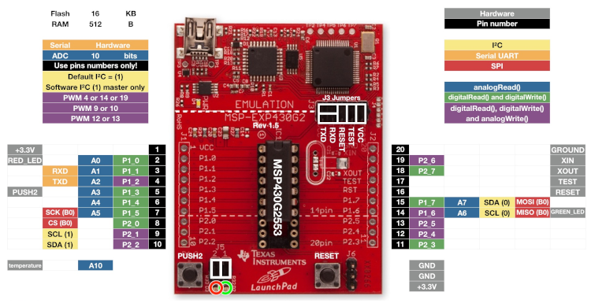

# Programando MSP430 no Raspberry Pi

Este tutorial tem como objetivo apresentar uma metodologia para programar microcontroladores MSP430 através do Raspberry Pi. Os procedimentos apresentados aqui são baseados em outro [tutorial](https://sergioprado.org/trabalhando-com-o-msp430-no-linux/) desenvolvido por Sergio Prado em sua página eletrônica [sergioprado.org](sergioprado.org), onde o foco é a programação do MSP430 no sistema Linux.

## Sumário

- [Programando MSP430 no Raspberry Pi](#programando-msp430-no-raspberry-pi)
  - [Sumário](#sumário)
  - [O microcontrolador MSP430](#o-microcontrolador-msp430)
  - [Kits de desenvolvimento _LaunchPad_](#kits-de-desenvolvimento-launchpad)
    - [O kit MSP-EXP430G2ET LaunchPad](#o-kit-msp-exp430g2et-launchpad)
    - [O kit MSP-EXP430G2](#o-kit-msp-exp430g2)
  - [O Raspberry Pi](#o-raspberry-pi)
  - [Requerimentos para a execução deste Tutorial](#requerimentos-para-a-execução-deste-tutorial)
  - [Instalando as ferramentas de desenvolvimento](#instalando-as-ferramentas-de-desenvolvimento)
  - [Criando códigos e Programando](#criando-códigos-e-programando)
  - [[Opcional] _Shell Script_ para compilação](#opcional-shell-script-para-compilação)
  - [Depurando (_debugando_) o código](#depurando-debugando-o-código)
    - [O mspdebug](#o-mspdebug)
    - [O msp430-gdb](#o-msp430-gdb)
  - [Fluxo de trabalho simplificado](#fluxo-de-trabalho-simplificado)
    - [Passo 1 - Desenvolver o código inicial](#passo-1---desenvolver-o-código-inicial)
    - [Passo 2 - Compilando o código](#passo-2---compilando-o-código)
    - [Passo 3 - Gravando o código](#passo-3---gravando-o-código)
    - [Passo 4 - Conectando ao _stub_ remoto para depuração](#passo-4---conectando-ao-stub-remoto-para-depuração)
    - [Passo 4 - Depurando o código](#passo-4---depurando-o-código)
  - [Conclusão](#conclusão)

## O microcontrolador MSP430

O termo MSP430 se refere a uma arquitetura de microcontroladores RISC (acrônimo de _Reduced Instruction Set Computer_; em português, "Computador com um conjunto reduzido de instruções") de 16 bits e arquitetura von-Neumann. É desenvolvido e comercializado pela [Texas Instruments](https://www.ti.com/microcontrollers/msp430-ultra-low-power-mcus/overview.html), com foco em baixo custo e baixo consumo de energia. Dependendo do modo de economia de energia da CPU, o chip pode chegar num consumo tão baixo quanto 100 nA. Uma imagem ilustrativa de um MSP430 pode ser vista na 
[Figura 1](#msp430).

||
|:---:|
|__Figura 1 - O microcontrolador MSP430__|

Possui diversos modelos, com um conjunto de periféricos bastante diversificado. Além disso, o fabricante oferece exemplos de programação de todos os periféricos, o que facilita muito o desenvolvimento de aplicações. Esses exemplos podem ser encontrados [clicando aqui](https://dev.ti.com/) (pode ser necessário criar uma conta).

## Kits de desenvolvimento _LaunchPad_

_LaunchPads_ são um conjunto de kits de desenvolvimento de baixo custo da Texas Instruments (TI). Para o microcontrolador MSP430 existe uma boa variedade de modelos de placas, sendo que a mais simples e barata é a [MSP-EXP430G2ET](https://www.ti.com/tool/MSP-EXP430G2ET), com um custo de U$ 9,99 (valaor verificado em 26/12/2020).

### O kit MSP-EXP430G2ET LaunchPad

O MSP-EXP430G2ET é o um do modelos mais simples e baratos que permite usar os microcontroladores MSP430 da série _Value Line_, sendo indicado para quem quer dar os passos iniciais nessa plataforma. Como pode ser visto na [Figura 2](#kit), o kit já vem de fábrica com o modelo MSP430G2553 instalado no soquete DIP (_Dual Inline Package_) de 20 pinos.

||
|:---:|
|__Figura 2 - MSP-EXP430G2ET LaunchPad: kit de desenvolvimento__|

Assim como o Arduino, o kit MSP-EXP430G2ET possui diversos pinos digitais de entrada e saída (GPIO), permitindo muita versatilidade aos projetos. Além disso, também possui dois LEDs e um botão. Como vantagem em relação à maioria dos modelos de Arduinos, essa placa possui embutida um gravador/depurador de código, permitindo a execução passo-a-passo das instruções. Além disso, não é necessário nenhum _bootloader_ para gravação.

### O kit MSP-EXP430G2

O MSP-EXP430G2, [Figura 3](#kit2), foi o kit utilizado para o desenvolvimento deste tutorial, devido a sua disponibilidade. É uma versão anterior e descontinuada do MSP-EXP430G2ET LaunchPad.

||
|:---:|
|__Figura 3 - MSP-EXP430G2 LaunchPad: kit de desenvolvimento utilizado neste tutorial__|

Apesar de ser mais antigo, o MSP-EXP430G2 possui praticamente as mesmas características que o MSP-EXP430G2ET.

## O Raspberry Pi

O Raspberry Pi é uma série computadores de tamanho reduzido feitos em uma única placa de circuito (_Single Board Computer_ ou SBC). Os modelos principais possuem o tamanho de um cartão de crédito, assim como pode ser visto na [Figura 4](#rpi).

|[")](https://commons.wikimedia.org/w/index.php?curid=80140656)|
|:---:|
|__Figura 4 - Imagem do Raspberry Pi 4 Model B__|

Apesar do tamanho reduzido, o Raspberry Pi é operado como um microcomputador convencional, permitindo a conexão de mouse, teclado e monitor. Além disso, é compatível com diversas distribuições do sistema operacional Linux, como é o caso do Ubuntu e do Raspberry Pi OS.

## Requerimentos para a execução deste Tutorial

Para este tutorial serão necessários os seguinte materiais:

 - Um Raspberry Pi de qualquer tipo (recomenda-se os modelos mais atuais como o Raspberry Pi 3, 4 e Zero W);
 - Catão microSD com o Raspberry Pi OS instalado ([Veja como clicando aqui](https://www.raspberrypi.org/documentation/installation/installing-images/));
 - Fonte de alimentação para o Raspberry Pi;
 - Cabo HDMI;
 - Monitor, teclado e mouse;
 - Conexão com a internet; e
 - Algum Microcontrolador MSP430 com gravador ([MSP-FET](https://www.ti.com/tool/MSP-FET)) ou Kit de desenvolvimento _LaunchPad_ (neste tutorial foi utilizado o MSP-EXP430G2).

 Além desses materiais, o usuário deverá possuir algum conhecimento básico de:

 - Microcontroladores;
 - Linguagem de programação C/C++;
 - Sistema Operacional Linux.

## Instalando as ferramentas de desenvolvimento

Para o MSP430, existem diversas ferramentas _open source_ para o desenvolvimento de projetos. Neste tutorial serão utilizadas as seguintes aplicações:

- [__gcc-msp430__](https://www.systutorials.com/docs/linux/man/1-msp430-gcc/): Porte do gcc (GNU C compiler) para o MSP430;
- __binutils-msp430__: Ferramentas de manipulação de binários (linker, assembler, etc.) para o MSP430;
- __msp430mcu__: Arquivos de cabeçalho, _spec files_ e scripts do linker;
- __msp430-libc__: Biblioteca C padrão;
- __gdb-msp430__: GNU _Debugger_ para o MSP430; e
- __mspdebug__: Ferramenta de gravação e _debugging_ do MSP430.

Estas ferramentas fazem parte do projeto [mspgcc](http://www.ti.com/tool/msp430-gcc-opensource), e estão empacotadas para algumas distribuições GNU/Linux, incluindo o Ubuntu, Fedora e Raspberry Pi OS.

<!---É importante notar que, embora não existam limitações de tamanho de código ou tempo de uso (pois trata-se de um _software_ livre), o mspgcc não possui suporte à algumas características presentes em versões proprietárias de outros compiladores. É o caso de opções de otimização de código.--->

Para instalar as ferramentas do mspgcc, abra uma instancia de terminal do Raspberry Pi OS e atualize os repositórios:

```console
sudo apt-get update
```

Em seguida, instale as ferramentas:


```console
sudo apt-get install msp430-libc mspdebug msp430mcu binutils-msp430 gcc-msp430 gdb-msp430
```

Depois de executado o comando acima, pode-se verificar se o _toolchain_ foi devidamente instalado executando o seguinte comando:

```console
msp430-gcc --version
```

Se tudo estiver certo, o comando deve retornar a versão do _software_ instalado e mais algumas informações, algo parecido com:

```console {.line-numbers}
msp430-gcc --version
msp430-gcc (GCC) 4.6.3 20120301 (mspgcc LTS 20120406 unpatched)
Copyright (C) 2011 Free Software Foundation, Inc.
This is free software; see the source for copying conditions. There is NO
warranty; not even for MERCHANTABILITY or FITNESS FOR A PARTICULAR PURPOSE.
```

Para outros procedimentos de instalação, acesse a página do projeto [mspgcc](http://www.ti.com/tool/msp430-gcc-opensource).

## Criando códigos e Programando

Para demostrar o fluxo de projeto utilizando as ferramentas instaladas, um simples código para piscar os dois LEDs do kit MSP-EXP430G2 será utilizado. Primeiramente, é recomendável criar uma pasta para o projeto. Em seguida,
crie o código fonte utilizando o editor de sua preferencia. Para usuários iniciantes recomenda-se utilizar o nano:

```console
nano pisca.c
```
Entre com o seguinte código:

```C {.line-numbers}
#include <msp430g2553.h>

#define LED1 0x01
#define LED2 0x40

int main(void){

    volatile int i = 0;         // Contador

    WDTCTL = WDTPW | WDTHOLD;   // Parar WDT

    P1DIR = LED1 + LED2;        // Pinos como saídas
    P1OUT = 0X00;               // Apaga os LEDs

    while(1){
        // Alterna estado dos LEDs
        P1OUT ^= LED1 | LED2; 
        for(i = 0; i < 10000; i++); // Atraso
    }
}
```

Alternativamente, pode-se baixar o código através do comando:

```Console
wget https://raw.githubusercontent.com/fpfrimer/piMSP430/main/codes/pisca.c
```

Para compilar, basta passar o modelo da CPU (mude de acordo com o chip que você esta usando):

```Console
msp430-gcc -g -Os -mmcu=msp430g2553 pisca.c -o pisca.elf
```

Sobre o comando segue algumas explicações:

- O argumento `-g` é invocado pois trata-se de um programa escrito em C. Importante para a utilização do __msp430-gdb__;
- `-Os` otimiza o código para tamanho;
- `-mmcu` indica o microcontrolador de destino;
- `-o` especifica o arquivo de saída;

Agora conecte o kit de desenvolvimento em uma das portas USB do Raspberry Pi. Isso deve criar um dispositivo do tipo ttyACM, que você consegue visualizar nas mensagens de log do kernel através do comando `dmseg`.

Para gravar no kit basta chamar a ferramenta mspdebug:

```Console
sudo mspdebug rf2500
```

Primeiro, programe o arquivo elf gerado:

```Console
(mspdebug) prog pisca.elf
```

E depois execute a aplicação:

```Console
(mspdebug) run
```

Pressione Ctrl+C para finalizar a execução. Digite o comando `exit` para sair do mspdebug.

Alternativamente, pode-se utilizar um único comando para o processo de gravação:

```Console
sudo mspdebug rf2500 "prog pisca.elf"
```

A diferença deste último comando é que o microcontrolador será programado, o código executado e o mspdebug será fechado.

É importante observar que em nenhum momento foi criado o _linker script_. O processo de compilação gerou um arquivo do tipo ELF, padrão para arquivos executáveis. O compilador, de acordo com a opção "-mmcu", já organizou o código (seções text, data, bss) de forma que a ferramenta mspdebug possa interpretar estas informações, para então endereçar e gravar corretamente os dados na memória flash do microcontrolador.

A ferramenta mspdebug possui muitas opções. Para uma lista completa das funcionalidades desta ferramenta, acesse sua página de manual:

```Console
man mspdebug
```

## [Opcional] _Shell Script_ para compilação

Para tornar o processo de compilação mais rápido, o usuário pode criar um arquivo _Shell Script_ para compilar o código. Para isso, crie um arquivo de texto com o seguinte comando:

```Console
echo "msp430-gcc -g -Os -mmcu=msp430g2553 pisca.c -o pisca.elf" > build
```

Neste caso, foi criado um arquivo nomeado como "build", sem extensão, mas o usuário pode colocar o nome que achar mais adequado.

Posteriormente, inclua permissão de execução no arquivo recém criado através do comando `chmod`:

```Console
sudo chmod +x build
```

Para compilar, basta executar o arquivo:

```Console
./build
```

## Depurando (_debugando_) o código

O processo de depuração, também conhecido pela expressão em inglês _debug_ (remoção de _bugs_), pode exigir do usuário um conhecimento grande sobre sobre o microcontrolador e da ferramenta de depuração. No caso do __mspdebug__ e do __msp430-gdb__, por não existir um interface gráfica, o processo de depuração pode ser complicado para usuários iniciantes ou, até mesmo, intermediários. Dessa forma, é recomendado a leitura do manual da ferramenta (`man mspdebug` e `man msp430-gdb`) e o estudo aprofundado sobre microcontroladores, especialmente o msp430.

### O mspdebug

O mspdebug é uma ferramenta acessada por linha de comando para depuração e programação para a família de microcontroladores MSP430. Como já visto no exemplo da seção [Criando códigos e Programando](#criando-códigos-e-programando), o mspdebug pode ser iniciado com o seguinte comando:

```Console
sudo mspdebug rf2500
```

O termo rf2500 é o nome do programador/depurador presente nos kits launchpad. Dessa forma, o usuário deve verificar o manual ao utilizar outra ferramenta. Até o momento foi apresentado os comandos `prog` e `run` para programar e rodar o código compilado, respectivamente. Outros comando úteis são apresentados na Tabela 1.


|Comando|Função| Exemplos de utilização|
|---|---|---|
|`prog <arquivo>`|programa o arquivo binário na memória flash do MSP430|`prog pisca.elf`|
|`erase`|limpa a memória do MSP430|`erase`|
|`run`|inicia a execução do programa|`run`|
|`reset`|reinicia a aplicação, retorna ao endereço de _reset_| `reset`|
|`regs`|mostra o estado dos registradores principais do MSP430|`regs`|
|`step [n]`|Executa `n` instruções, uma se não indicar a quantidade|`step`, `step 5`|
|`setbreak [endereço]`|posiciona um _breakpoint_ em um endereço de memória|`setbreak 0xc010 `|
|`delbreak`|remove os _breakpoints_|`delbreak`|
|`break`|lista os _breakpoints_ disponíveis|`break`|
|`gdb [port]`|cria um serviço de depuração remoto para o gdb|`gdb 2000`|
__Tabela 1 - Lista de alguns comandos do mspdebug__

O comando `regs` é muito importante para o usuário verificar o que está sendo executado no momento. Com ele é possível visualizar o conteúdo dos principais registradores do MSP430, como é o caso do PC, SP e SR. Além disso, também é possível visualizar o _disassembly_, veja o resultado do comando:

```
(mspdebug) regs
    ( PC: 0c014)  ( R4: 08175)  ( R8: 0cbf5)  (R12: 084f4)  
    ( SP: 00400)  ( R5: 05a08)  ( R9: 0ffd7)  (R13: 02e65)  
    ( SR: 00000)  ( R6: 07db6)  (R10: 03cf9)  (R14: 07786)  
    ( R3: 00000)  ( R7: 0bff7)  (R11: 02591)  (R15: 00000)  
__wdt_clear_value+0xbe14:
    0c014: 0f 93                     TST     R15
    0c016: 08 24                     JZ      0xc028
    0c018: 92 42 00 02 20 01         MOV     &__wdt_clear_value, &0x0120
    0c01e: 2f 83                     DECD    R15
    0c020: 9f 4f                     
    0c022: 7a c0 
```

Como pode ser notado, ao executar o comando `step`, o código pode ser executado instrução por instrução com base no código de máquina gerado no processo de compilação. Dessa forma, a depuração de um código escrito em linguagem C/C++ não é possível através do mspdebug. Neste sentido, a ferramenta msp430-gdb deve ser utilizada em conjunto com o mspdebug para depuração do código fonte.

### O msp430-gdb

O GDB (GNU _Project Debugger_) é uma ferramenta para:  observar um programa enquanto este executa; e ver o estado no momento que a execução falha. Permite: 

- iniciar a execução de um programa;
- executar linha-a-linha;
- especificar pontos de paragem;
- imprimir valores de variáveis;
- entre outras funcionalidades.

O __msp430-gdb__ é uma ferramenta para conectar o GDB com os microcontroladores MSP430 para depurar o software que está sendo desenvolvido.

A próxima seção apresenta um fluxo de trabalho simplificado para depuração de projetos com microcontroladores MSP430 através do __msp430-gdb__.

## Fluxo de trabalho simplificado

Esta seção tem o intuito de apresentar as funcionalidades das ferramentas apresentadas, mostrando um exemplo fluxo de trabalho para utilização do __msp430-gdb__ em conjunto com o __mspdebug__.

Considere o seguinte projeto exemplo: 

> Utilize os dois LEDs presentes no kit MSP-EXP430G2 Launchpad para realizar uma contagem de 0 à 3 em binário. Note na Figura 6 que os LEDs estão conectados nos pinos P1.6 (GREEN_LED) e P1.0 (RED_LED).
> 
> |[](https://energia.nu/pinmaps/img/LaunchPadMSP430G2452-v1.5.jpg)|
> |:---:|
> |__Figura 6 - Pinagem do kit MSP-EXP430G2 Launchpad__|

### Passo 1 - Desenvolver o código inicial

Ao desenvolver o projeto, o usuário pode obter o seguinte código:

```C
  1 #include<msp430g2553.h>
  2
  3 #define     RED_LED     BIT0        // P1.0 - BIT0 da P1
  4 #define     GREEN_LED   BIT6        // P1.6 - BIT6 da P1
  5
  6 int main(void){
  7     volatile int i = 0, cont = 0;
  8     volatile int delay = 20000;
  9
 10     WDTCTL = WDTPW | WDTHOLD;       // Parar WDT
 11     P1DIR |= RED_LED + GREEN_LED;   // LEDs como saída
 12     P1OUT = 0;
 13
 14     while(1){
 15         for(i = 0; i <= delay; i++);// Atraso
 16         cont += 1;                  // Incrementa contador
 17
 18         /* Utiliza os dois bits menos significativos do contador */
 19         P1OUT = ((cont & BIT1) << 5) | (cont & BIT0);
 20     }
 21     return 0;
 22 }

```

Os números das linhas foram inseridos para facilitar a visualização do exemplo. Crie uma pasta para o projeto e copie o código em um arquivo nomeado como `contador.c`. Alternativamente, pode-se baixar o código com o seguinte comando:

```Console
wget https://raw.githubusercontent.com/fpfrimer/piMSP430/main/codes/contador.c
```

### Passo 2 - Compilando o código

Compile o código utilizando o comando apresentado na seção [Criando códigos e Programando](#criando-códigos-e-programando), mudando os nomes dos arquivos de entrada e saída como `contador.c` e `contador.elf` respectivamente. 

### Passo 3 - Gravando o código

Os procedimentos dessa seção são semelhantes ao apresentado na seção [Criando códigos e Programando](#criando-códigos-e-programando). Dessa forma, para gravar no kit, chame a ferramenta mspdebug:

```Console
sudo mspdebug rf2500
```

Programe o arquivo elf gerado:

```Console
(mspdebug) prog contador.elf
```

Execute o código com o comando `run`:

```Console
(mspdebug) run
```

Ao gravar o código, os LEDs do kit realizarão a contagem.

### Passo 4 - Conectando ao _stub_ remoto para depuração

Para depurar, primeiro inicie o _stub_ remoto do gdb. Este stub será a interface entre o gdb client e a interface de comunicação com o chip. Ainda dentro do mspdebug digite:

```Console
(mspdebug) gdb 2000
```

Esse comando "trava" o mspdebug que fica esperando uma conexão através da porta 2000. Dessa forma, é preciso abrir outro terminal e executar o msp430-gdb com o arquivo gerado pela compilação:

```Console
msp430-gdb contador.elf
```

Dentro do cliente GDB, conecte-se no _stub_ para iniciar a seção de depuração:

```Console
(gdb) target remote localhost:2000
```

Como se trata de uma conexão remota, preste atenção aos comandos que são diferentes em relação à execução local.

### Passo 4 - Depurando o código

O GDB é uma ferramenta muito poderosa e de código aberto para a depuração de códigos. As possibilidades de comandos são variadas, sendo impossível listar tudo neste tutorial. Dessa forma, será apresentado alguns exemplos de comandos para a depuração do código.

Use o comando `continue` ou `c` para rodar o código. Note que o programa será executado e o cliente GDB ficará em espera, pois nenhum _breakpoint_ foi inserido ainda. Pressione CTRL+C para parar. Para inserir um _breakpoint_ use o comando `break` seguido do nome do arquivo C/C++ e da linha:

```Console
(gdb) break contador.c:16
```

Note que a linha 16 representa no código `cont += 1`. Ao rodar novamente a aplicação com o comando `c`, a execução será interrompida na linha 16. Use o comando `print` para imprimir o valor de alguma variável. No caso da variável `cont`:

```Console
(gdb) print cont
```

Este comando resultará na seguinte mensagem, indicando que a variável `cont` possui o valor 1309:

```Console
(gdb) print cont
$1 = 1309
```

> Obs.: O usuário que estiver seguindo a este tutorial provavelmente fará a leitura de outro valor.

Execute o comando `c` novamente para a aplicação "rodar" mais um ciclo, parando novamente no _breakpoint_ da linha 16. Imprima novamente o valor da variável `cont` e perceba que ela foi incrementada em uma unidade. Alternativamente, utilize as variantes `print/x` ou `print/t` para imprimir em hexadecimal ou binário, respectivamente.

Agora, faça leitura da variável `delay` e verifique que ela possui o valor 20000, assim como o esperado.

Ajuste o valor de uma variável com o comando `set`. No caso da variável `delay`:

```Console
(gdb) set delay=30000
```

Ao fazer a leitura novamente de `delay` note que o valor foi atualizado para 30000. Uso resultará em um atraso maior e a contagem deverá ser mais lenta. No entanto, para verificar esse efeito, é necessário remover o _breakpoint_ da linha 16. Dessa forma, entre com o seguinte comando:

```Console
(gdb) clear contador.c:16
```

Rode a aplicação novamente com o comando `c` e perceba que a contagem está mais lenta agora. 

Interrompa novamente a execução pressionando CTRL+C. Execute o comando `info registers` para fazer uma leitura dos estado dos registradores, o resultado será parecido com:

```Console
(gdb) info registers
pc/r0: c070  sp/r1: 03fa  sr/r2: 0000     r3: 0000
fp/r4: 807d     r5: 5a08     r6: 5db6     r7: 932e
   r8: dadd     r9: 7a17    r10: 0ce8    r11: 2590
  r12: 84f4    r13: eb24    r14: 7530    r15: 2a0f
```

Para imprimir o valores de registradores de periféricos, é necessário verificar o endereço de interesse no _datasheet_ do microcontrolador utilizado. Por exemplo, para fazer a leitura do valor armazenado no registrador P1DIR do msp430g2553, deve-se verificar no datasheet do dispositivo que o endereço de memória é o 0x0022. Dessa forma, o comando print deve ser modificado para:

```Console
(gdb) print{char}0x22
```

Isso resulta em:

```Console
(gdb) print{char}0x22
$11 = 65 'A'
```

Note que o resultado foi dado em decimal e em caractere ASCII. A opção colocada entre as chaves indica a quantidade de bytes que deve ser lida. no caso de `char` a leitura é de apenas um byte. Para facilitar a leitura pode-se utilizar as alternativas `print/x{char}0x22` e `print/t{char}0x22` para imprimir em hexadecimal e binário respectivamente.

Para ajustar o valor de um registrador de periférico, também pode utilizado o comando `set`. Como exemplo, o registrador P1OUT no msp430g2553, que controla os LEDs, está no endereço 0x0021. Dessa forma, utilize o seguinte comando para apagar os dois LEDs:


```Console
(gdb) set{char}0x21 = 0
```

Para acender os dois LEDs:

```Console
(gdb) set{char}0x21 = 0x41
```

Para registradores de 16 bits mude a opção `char` para `int` tanto no comando `print` quanto no `set`.

## Conclusão

Este tutorial mostrou como programar microcontroladores MSP430 através do Raspberry Pi. Foi apresentado as principais ferramentas no processo de programação e depuração, todas de código aberto. Foi dado ênfase em um fluxo de projeto utilizando linhas de comando, através de um exemplo passo-a-passo.